## Primeiros passos

Ao pegar o projeto pela primeira vez, li todos os requisitos e fiz diagramas visuais para deixar mais prática a consulta. Após isso, comecei a decidir as tecnologias e a arquitetura do projeto.

### Listar estudantes

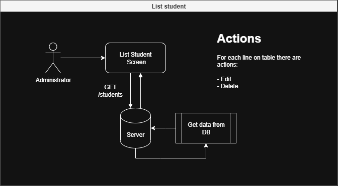

### Inserir estudante

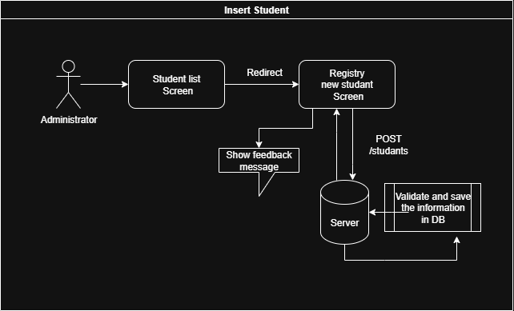

### Atualizar estudante

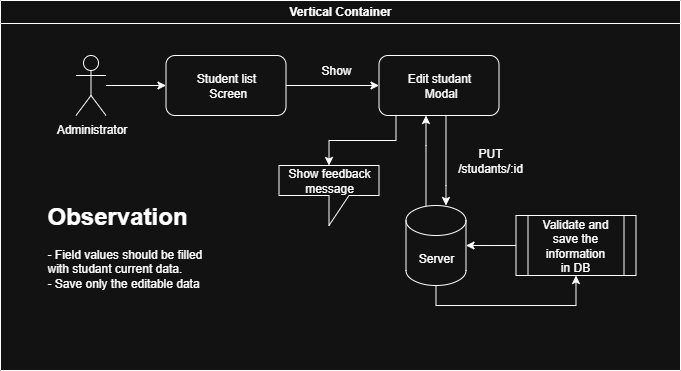

### Deletar estudante

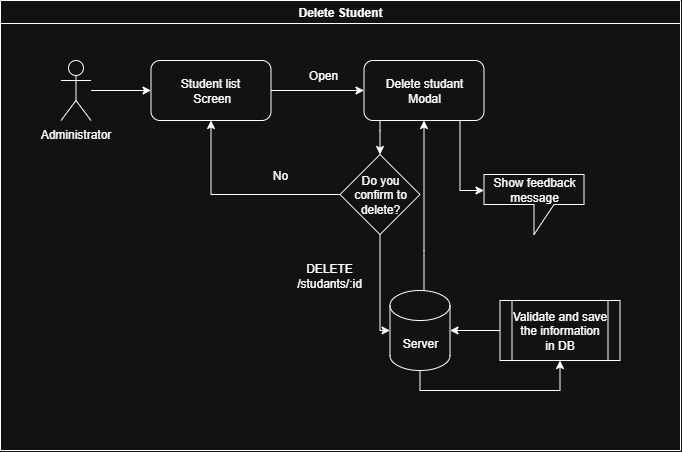

## Backend

Sou um desenvolvedor Fullstack e tive mais experiência na parte do backend, então pode ser que ele esteja um pouco mais “tunado” do que o frontend.

### Arquitetura

Decidi seguir o que geralmente faço em projetos pessoais: aplicar os princípios da arquitetura limpa (Clean Architecture), DDD (Domain-Driven Design) e, dessa vez, implementar a separação por módulos.

#### Clean Architecture e DDD

Os princípios da arquitetura limpa e do DDD estão presentes no projeto na parte de separação do domínio da regra de negócio, nos casos de uso, no princípio de responsabilidade única, na reutilização de código com a pasta "shared" e na segregação de interfaces na parte das rotas.

#### Monólito modular

Decidi utilizar o design de sistema de monólito modular, pois ele garante várias vantagens: escalabilidade de equipe (permitindo a separação por módulos) e agilidade na migração para microsserviços (já que o projeto está modularizado, é vantajoso migrar cada módulo separadamente).

Apesar de o projeto ser pequeno e não trazer tantas vantagens em deixá-lo complexo com arquiteturas altamente escaláveis, utilizei esse formato para demonstrar minhas capacidades.

##### Módulos

Separei o projeto em dois módulos principais: Health e Students.

##### Health

Possui testes de conexão públicos, servindo para verificar a conectividade e o estado de saúde do servidor.

##### Students

Possui todas as funcionalidades relacionadas ao estudante, sendo elas: criação, leitura, atualização e exclusão de seus dados.

### Testes

Incluí testes de integração e de unidade no backend, com taxa de cobertura de 100% para ambos:

#### Unidade

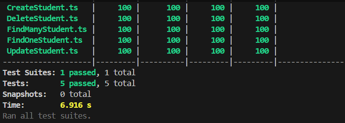

#### Integração

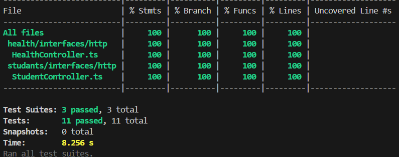

Para os testes de unidade, utilizei a biblioteca **Jest**, e para os testes de integração, utilizei **Supertest**.

#### Husky

Utilizei o Husky para garantir a integridade dos commits. Ele faz as seguintes verificações antes de o código ser comitado:

* Verifica se o projeto está bem configurado com **ESLint**
* Roda os testes de integração e unidade do backend

### Segurança

Adicionei um middleware para verificar a segurança das requisições e evitar vulnerabilidades clássicas como DoS (Denial of Service), CORS e SQL Injection, entre outras.

Bibliotecas usadas: **helmet**, **cors**, **express-rate-limit**, **hpp**.

### Docker

Incluí a configuração de containerização com Docker e Docker Compose para ambientes de desenvolvimento e produção.

## Frontend

### Vue e Vuetify

Implementei o frontend com o framework Vuetify, utilizando Vite, TypeScript e ESLint. O ambiente segue os mesmos princípios de arquitetura do backend.

### Reutilização de código

Reutilizei a arquitetura de exceções do backend e a adaptei para o uso no frontend, com validação no service.

### UI

Implementei a interface utilizando os componentes do Vuetify, que por sua vez usa o Material UI na composição.

#### Theme toggle

Implementei a opção de trocar entre tema claro e escuro:

##### Tema escuro

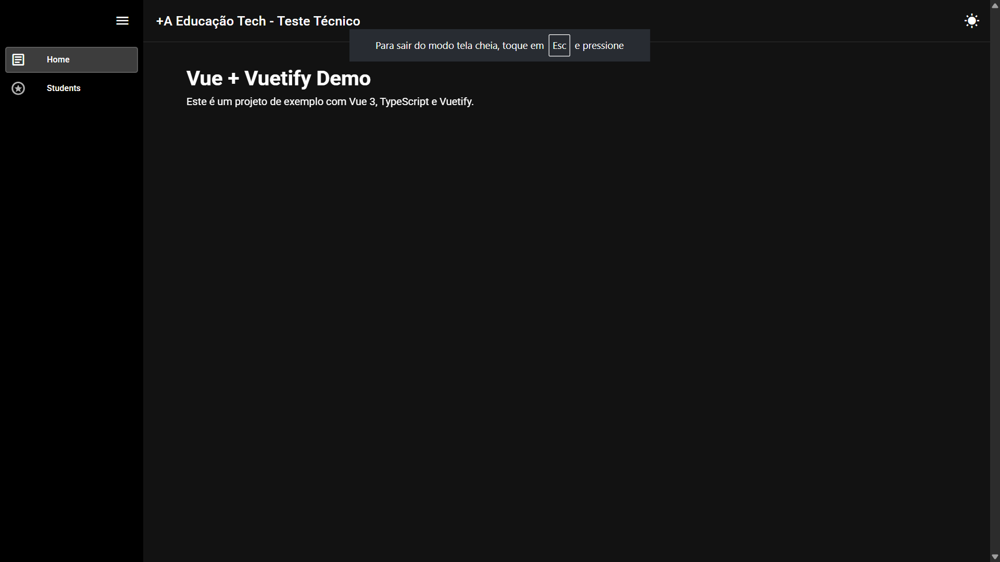

##### Tema claro

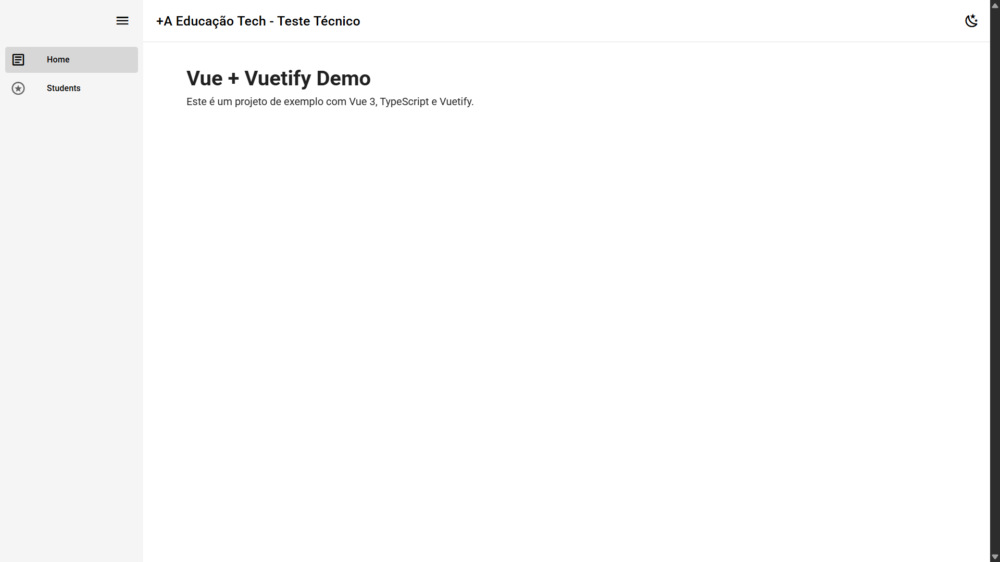

#### Lista de estudantes

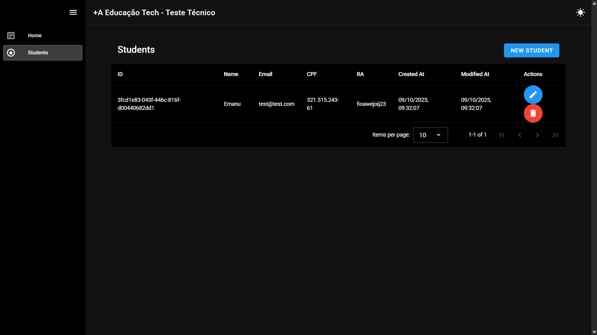

#### Confirmar exclusão

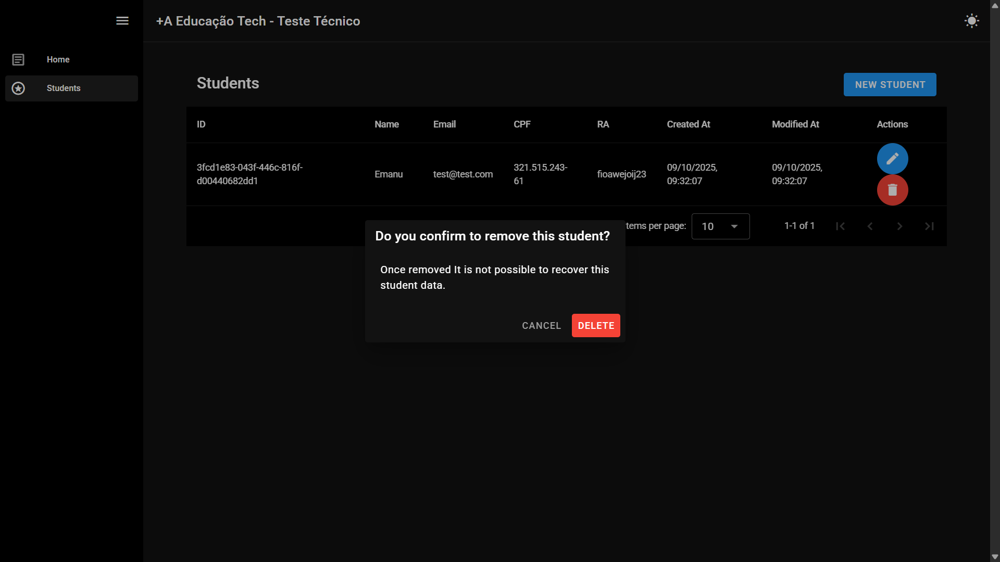

#### Editar um estudante

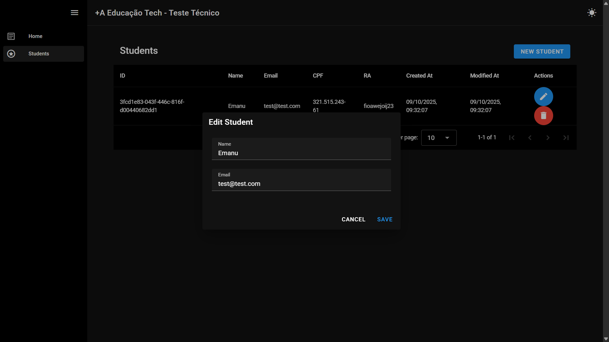

#### Inserir um estudante

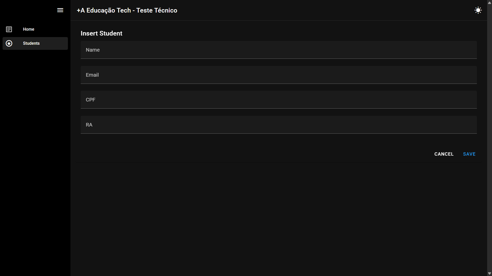

## Considerações finais

Gostei bastante do desafio. Ele enriqueceu meu repositório com mais código e também achei interessante o fato de solicitarem uma boa arquitetura como um dos principais requisitos.
